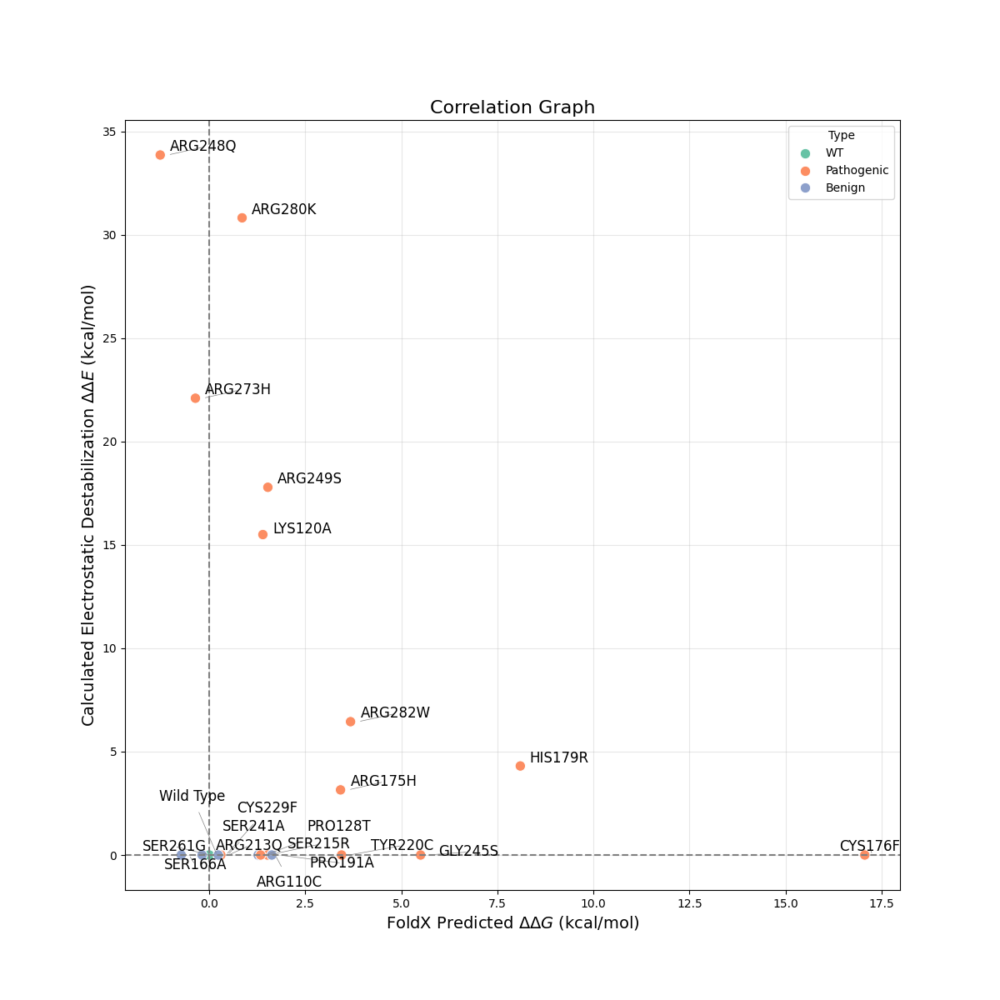

# Mechanistic Classification of p53 Cancer Mutations Using Electrostatic and Stability-Based Computational Analysis

**A computational study distinguishing structural vs. functional pathogenicity in the p53 tumor suppressor.**

## 🧬 Project Overview
The p53 protein ("guardian of the genome") is mutated in approximately 50% of all human cancers. These mutations generally disable the protein in one of two ways:
1.  **Structural Destabilization:** The protein core unfolds.
2.  **Loss of DNA Binding:** The protein stays folded but loses its grip on DNA.

Standard computational tools (like FoldX) are excellent at detecting structural defects but often miss DNA-binding defects, leading to false negatives for critical cancer hotspots.

This project uses a custom C engine designed to bridge this gap. By calculating explicit interfacial electrostatics, it detects the "silent" loss-of-function variants that standard stability predictors miss.

---

## 🔬 The Scientific Problem
Biophysically, pathogenicity is not a single metric.
* **FoldX** measures $\Delta\Delta G_{folding}$ (Stability).
* **Electrostatic engine** measures $\Delta E_{binding}$ (Affinity).

A mutation like **R248Q** (Arg $\to$ Gln) is a classic "Contact Mutation." It removes a positive charge essential for clamping onto DNA. Because this occurs on the surface, the protein structure remains stable. Consequently, standard tools predict it as "Benign" ($\Delta\Delta G \approx 0$).

**Hypothesis:** A dual-scoring system combining Folding Stability + Binding Electrostatics is required to accurately classify the full spectrum of p53 mutations.

---

## ⚙️ Methodology: How the Engine Works

### 1. The Custom C-Engine (`engine.c`)
I developed a rigid-body physics engine in **C** to calculate the non-bonded interaction energy between p53 and DNA. It uses an $O(N^2)$ pairwise potential summation:
* **Electrostatics:** Coulomb’s Law ($q_i q_j / r_{ij}$) to measure charge-charge attraction.
* **Sterics:** Lennard-Jones Potential to measure shape complementarity.
* *Optimization:* Written in C for performance, accessed in Python via `ctypes`.

### 2. The Hybrid Pipeline
The project benchmarks 20 clinically significant variants using two orthogonal metrics:
* **Binding Score:** Calculated by my C-engine (modifying charge parameters in silico).
* **Stability Score:** Calculated by FoldX 5.1 (repairing and mutating PDB structure).

---

## 📊 Key Results

The study revealed a distinct mechanistic separation of mutations, visualized in the correlation plot below.



### The "Three-Class" Classification System
1.  **Type I: Electrostatic Disruptors (Top-Left)**
    * *Examples:* R248Q, R273H, R280K.
    * *Mechanism:* Loss of the positive "electrostatic clamp."
    * *Detection:* Invisible to FoldX, but flagged as high-energy defects (>20 kcal/mol) by my C-engine.

2.  **Type II: Structural Destabilizers (Bottom-Right)**
    * *Examples:* R175H, C176F (Zinc-binding loss).
    * *Mechanism:* Global unfolding or core collapse.
    * *Detection:* Invisible to my rigid-body C-engine, but flagged by FoldX.

3.  **Type III: Subtle/Conformational Defects (Origin)**
    * *Examples:* S241A, R213Q.
    * *Mechanism:* Loss of specific H-bonds or subtle allosteric shifts.
    * *Detection:* Missed by both coarse-grained methods, highlighting the need for future Molecular Dynamics integration.

---

## 📂 Code Structure

* **`engine.c`**: The core physics engine. Contains the math for Coulomb and Lennard-Jones potentials.
* **`scanner.py`**: The Python wrapper. It parses the PDB file, extracts atomic coordinates/charges, and sends them to the C-library.
* **`batch_runner.py`**: The automation script. It loops through the dataset of 20 mutations, applies the virtual mutagenesis, and logs the results.
* **`1TSR.pdb`**: The repaired crystal structure of the p53-DNA complex.

---

## 🚀 How to Run

1.  **Compile the Physics Engine:**
    ```bash
    gcc -shared -o libenergy.so -fPIC engine.c -lm -O3
    ```

2.  **Run the Analysis:**
    ```bash
    python batch_runner.py
    ```
    *This will generate `scan_results.csv` containing the electrostatic scores for all 
